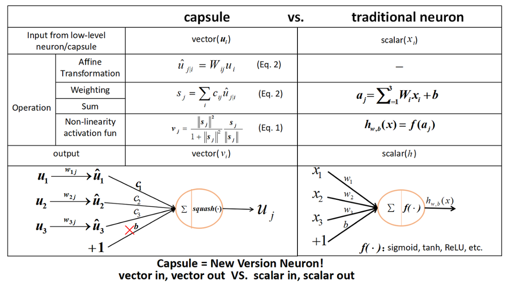

# CapsNet-tensorflow-jupyter

[](https://opensource.org/licenses/Apache-2.0) [](CONTRIBUTING.md)

A Tensorflow implementation of [CapsNet](https://arxiv.org/abs/1710.09829), based on my understanding. This repository is built with an aim to simplify the concept, implement and understand it.

Any suggestions, or any mistake you find, I'll be happy to entertain.

Credits for this amazing comparison: <https://github.com/naturomics/CapsNet-Tensorflow> 

## Requirements

- python3
- numpy==1.13.1
- tensorflow==1.3.0

## Usage

Clone this repository with `git`.

```
$ git clone https://github.com/rrqq/CapsNet-tensorflow-jupyter.git
$ cd CapsNet-tensorflow-jupyter-master
```

### Run Options

1. Use Jupyter Notebook
2. From linux terminal:

  ```
  $ script -c "sudo python3 main.py" train_log.txt
  ```

Test Accuracy: 99.19 % # First round with default parameters as in paper.

### Reference

[In depth analysis.](https://github.com/naturomics/CapsNet-Tensorflow)
